# AfroPay — Data-Flow Diagram (DFD)

**Version:** 1.0.0  
**Date:** 2026-07-30  
**Status:** Active  
**Authors:** Security Engineering

---

## Overview

This document provides a Level-1 Data-Flow Diagram (DFD) of the AfroPay remittance system. It identifies all processes, external entities, data stores, and the five trust boundaries that separate security zones. The DFD is the primary input for the [STRIDE analysis](./stride-analysis.md).

---

## System Boundary Map

```
┌─────────────────────────────────────────────────────────────────────────────────────────┐
│  INTERNET                                                                               │
│                                                                                         │
│   [Browser / Mobile App]        [Flutterwave]        [Paystack]                        │
│          │                           │                    │                             │
│ ═════════╪═══════════ TB-1 (Browser ↔ API) ══════════════╪════════════════════════════ │
│          │                           │                    │                             │
│   ┌──────▼───────────────────────────▼────────────────────▼──────────────────────────┐ │
│   │  AfroPay API Layer (Express / NestJS)                                             │ │
│   │                                                                                   │ │
│   │  ┌─────────────┐  ┌──────────────┐  ┌──────────────┐  ┌────────────────────┐    │ │
│   │  │  SEP-10 Auth│  │  Escrow API  │  │ Webhook Rcvr │  │  Oracle Submit     │    │ │
│   │  │  (JWT/Ed25519│  │  Routes     │  │ (FLW/Paystack│  │  Endpoint          │    │ │
│   │  └──────┬──────┘  └──────┬───────┘  └──────┬───────┘  └────────┬───────────┘   │ │
│   │         │                │                  │                   │               │ │
│   │  ┌──────▼────────────────▼──────────────────▼───────────────────▼─────────────┐ │ │
│   │  │  AML / Fraud Check Service (Rust)  │  Reconciliation Service               │ │ │
│   │  │  Redis Queue (BullMQ)              │  Postgres (event store)               │ │ │
│   │  └────────────────────────────────────────────────────────────────────────────┘ │ │
│   └──────────────────────────────────────┬───────────────────────────────────────────┘ │
│                                          │                                              │
│ ════════════════════════ TB-2 (API ↔ Soroban) ══════════════════════════════════════   │
│                                          │                                              │
│   ┌──────────────────────────────────────▼────────────────────────────────────────┐    │
│   │  Stellar Network / Soroban VM                                                  │    │
│   │                                                                                │    │
│   │  ┌────────────────────────────┐   ┌────────────────────────────────────────┐  │    │
│   │  │  RemittanceContract        │   │  EscrowContract                        │  │    │
│   │  │  deposit_escrow()          │   │  (contracts/escrow/src/lib.rs)         │  │    │
│   │  │  release_to_agent()        │   │                                        │  │    │
│   │  │  claim_refund()            │   │                                        │  │    │
│   │  │  register_oracle()         │   │                                        │  │    │
│   │  └────────────────────────────┘   └────────────────────────────────────────┘  │    │
│   │                                                                                │    │
│   │  ┌────────────────────────────────────────────────────────────────────────┐   │    │
│   │  │  USDC Token Contract (Circle — Stellar-issued)                         │   │    │
│   │  └────────────────────────────────────────────────────────────────────────┘   │    │
│   └────────────────────────────────────────────────────────────────────────────────┘    │
│                                                                                         │
└─────────────────────────────────────────────────────────────────────────────────────────┘
```

---

## Full DFD — Level 1

```mermaid
flowchart TD
    %% ── External Entities ──────────────────────────────────────────────────────
    Browser(["fa:fa-user  Browser / Mobile App\n(Sender)"])
    Recipient(["fa:fa-user-check  Recipient\n(Off-ramp beneficiary)"])
    FLW(["fa:fa-credit-card  Flutterwave\n(Off-ramp PSP)"])
    Paystack(["fa:fa-credit-card  Paystack\n(Off-ramp PSP)"])
    Horizon(["fa:fa-globe  Stellar Horizon\n(Public API)"])
    CBN(["fa:fa-university  CBN Rate API\n(Central Bank of Nigeria)"])
    StellarDEX(["fa:fa-chart-line  Stellar DEX\n(Order-book via Horizon)"])
    FLWRate(["fa:fa-exchange-alt  Flutterwave\nRate API"])
    Admin(["fa:fa-user-shield  Admin / Operator"])

    %% ── Data Stores ────────────────────────────────────────────────────────────
    Postgres[("fa:fa-database  Postgres\nevent store / checkpoints")]
    Redis[("fa:fa-memory  Redis\nBullMQ queues")]
    SorobanState[("fa:fa-link  Soroban\nContract Storage")]

    %% ── Processes ───────────────────────────────────────────────────────────────
    API["P1: AfroPay API\n(Express)"]
    SEP10["P2: SEP-10 Auth\n(HS256 / Ed25519 JWT)"]
    EscrowRoute["P3: Escrow Routes\n(POST /escrow, /release)"]
    WebhookFLW["P4: Flutterwave Webhook\n(HMAC-SHA512 verify)"]
    WebhookPS["P5: Paystack Webhook\n(HMAC-SHA256 verify)"]
    AML["P6: AML / Fraud\n(Rust rules engine)"]
    Reconcile["P7: Reconciliation\n(off-chain ↔ on-chain)"]
    OracleAgg["P8: Oracle Aggregator\n(median of 3 providers)"]
    Listener["P9: Horizon Listener\n(SSE stream + checkpoint)"]
    Contract["P10: RemittanceContract\n(Soroban WASM)"]
    USDC["P11: USDC Token Contract\n(Circle, Stellar-issued)"]
    DLQ["P12: Dead Letter Queue\n(BullMQ / Redis)"]

    %% ═══════════════════════════════════════════════════════════════════════════
    %% TRUST BOUNDARY 1 — Browser ↔ API
    %% ═══════════════════════════════════════════════════════════════════════════
    subgraph TB1 ["🔴 TB-1 · Browser ↔ API  (HTTPS / SEP-10 JWT)"]
        Browser -->|"HTTPS POST /auth/challenge\n[SEP-10 step 1]"| SEP10
        SEP10 -->|"Challenge XDR"| Browser
        Browser -->|"Signed challenge XDR\n[SEP-10 step 2]"| SEP10
        SEP10 -->|"JWT token"| Browser

        Browser -->|"POST /escrow\n{sender, corridor, amount}\nBearer JWT"| EscrowRoute
        Browser -->|"GET /escrow/:id/stream\n(SSE)"| EscrowRoute
        EscrowRoute -->|"escrow_id, state"| Browser
        Admin -->|"POST /escrow/:id/release\nBearer JWT (Ed25519)"| EscrowRoute
    end

    %% ═══════════════════════════════════════════════════════════════════════════
    %% TRUST BOUNDARY 2 — API ↔ Soroban
    %% ═══════════════════════════════════════════════════════════════════════════
    subgraph TB2 ["🟠 TB-2 · API ↔ Soroban  (Stellar XDR / Ed25519 signing)"]
        EscrowRoute -->|"deposit_escrow() XDR tx\n[relayer signs, broadcasts]"| Contract
        EscrowRoute -->|"release_to_agent() + OracleAttestation"| Contract
        EscrowRoute -->|"claim_refund()"| Contract
        Contract -->|"USDC transfer (SAC)"| USDC
        Contract -->|"Ledger events\n(DepositEvent, ReleaseEvent)"| SorobanState
        Admin -->|"register_oracle() / set_paused()"| Contract
    end

    %% ═══════════════════════════════════════════════════════════════════════════
    %% TRUST BOUNDARY 3 — API ↔ Flutterwave / Paystack
    %% ═══════════════════════════════════════════════════════════════════════════
    subgraph TB3 ["🟡 TB-3 · API ↔ Flutterwave / Paystack  (HMAC-signed webhooks)"]
        Browser -->|"Fiat deposit (card / bank)"| FLW
        Browser -->|"Fiat deposit (card / bank)"| Paystack
        FLW -->|"Webhook POST verif-hash\n(HMAC-SHA512)"| WebhookFLW
        Paystack -->|"Webhook POST x-paystack-signature\n(HMAC-SHA256)"| WebhookPS
        WebhookFLW -->|"Escrow state update\nor DLQ enqueue"| DLQ
        WebhookPS -->|"Escrow state update\nor DLQ enqueue"| DLQ
        DLQ -->|"Retry / dead letter"| Reconcile
    end

    %% ═══════════════════════════════════════════════════════════════════════════
    %% TRUST BOUNDARY 4 — Relayer ↔ Horizon
    %% ═══════════════════════════════════════════════════════════════════════════
    subgraph TB4 ["🔵 TB-4 · Relayer ↔ Horizon  (Stellar SDK / HTTPS)"]
        Listener -->|"GET /transactions?cursor=<cp>\n(SSE stream)"| Horizon
        Horizon -->|"Transaction events\n(paging_token)"| Listener
        Listener -->|"checkpoint write"| Postgres
        Listener -->|"Catch-up replay on gap"| Horizon
        EscrowRoute -->|"Submit signed XDR tx"| Horizon
        Horizon -->|"tx result (success / fail)"| EscrowRoute
    end

    %% ═══════════════════════════════════════════════════════════════════════════
    %% TRUST BOUNDARY 5 — Oracle ↔ Rate Providers
    %% ═══════════════════════════════════════════════════════════════════════════
    subgraph TB5 ["🟣 TB-5 · Oracle ↔ Rate Providers  (unauthenticated HTTP)"]
        OracleAgg -->|"GET /order_book?...\n(unauthenticated)"| StellarDEX
        OracleAgg -->|"GET /api/public/rates\n(unauthenticated)"| CBN
        OracleAgg -->|"GET rate endpoint\n(API key)"| FLWRate
        StellarDEX -->|"bid/ask prices"| OracleAgg
        CBN -->|"centralRate"| OracleAgg
        FLWRate -->|"exchange rate"| OracleAgg
        OracleAgg -->|"median rate\n(outlier-rejected)"| EscrowRoute
        OracleAgg -->|"stale / unavailable alert"| Redis
    end

    %% ── Cross-boundary flows ────────────────────────────────────────────────
    SEP10 -->|"JWT validation result"| EscrowRoute
    EscrowRoute -->|"AML check request"| AML
    AML -->|"risk score / block"| EscrowRoute
    EscrowRoute -->|"append events"| Postgres
    Reconcile -->|"compare escrow states"| Postgres
    Reconcile -->|"query on-chain state"| Horizon
    Recipient -->|"Fiat payout (bank / mobile money)"| FLW
    Recipient -->|"Fiat payout (bank / mobile money)"| Paystack

    %% ── Styling ─────────────────────────────────────────────────────────────
    classDef external fill:#e8f4f8,stroke:#2980b9,color:#1a252f
    classDef process  fill:#eafaf1,stroke:#27ae60,color:#1a252f
    classDef store    fill:#fef9e7,stroke:#f39c12,color:#1a252f
    classDef boundary fill:#fdedec,stroke:#e74c3c,color:#922b21

    class Browser,Recipient,FLW,Paystack,Horizon,CBN,StellarDEX,FLWRate,Admin external
    class API,SEP10,EscrowRoute,WebhookFLW,WebhookPS,AML,Reconcile,OracleAgg,Listener,Contract,USDC,DLQ process
    class Postgres,Redis,SorobanState store
```



---

## Trust Boundary Definitions

| ID | Boundary | Description | Protocol | Authentication |
|----|----------|-------------|----------|----------------|
| **TB-1** | Browser ↔ API | End-users and admin operators calling the REST API over the public internet | HTTPS (TLS 1.2+) | SEP-10 JWT (HS256 or Ed25519) |
| **TB-2** | API ↔ Soroban | The API relayer layer submitting transactions to the Stellar/Soroban contract | Stellar XDR over HTTPS to Horizon | Ed25519 key-pair signing of XDR transactions |
| **TB-3** | API ↔ Flutterwave/Paystack | Inbound webhook notifications from off-ramp payment service providers | HTTPS inbound POST | HMAC-SHA512 (Flutterwave) / HMAC-SHA256 (Paystack) shared-secret signature |
| **TB-4** | Relayer ↔ Horizon | The Horizon SSE listener and transaction broadcaster connecting to the Stellar public API | HTTPS / Server-Sent Events | No auth (public Horizon); relies on TLS for integrity |
| **TB-5** | Oracle ↔ Rate Providers | The oracle aggregator polling three external FX rate data sources | HTTPS (unauthenticated for CBN/StellarDEX; API-key for Flutterwave) | None (CBN, StellarDEX) / API key (Flutterwave Rate API) |

---

## Key Data Assets

| Asset | Sensitivity | Location |
|-------|-------------|----------|
| Relayer private key (Ed25519) | Critical | Environment variable / HSM |
| Oracle operator private key | Critical | Oracle service environment |
| Admin contract key | Critical | Multi-sig, cold storage |
| SEP-10 JWT signing secret | High | API environment variable |
| FLW_WEBHOOK_SECRET / PAYSTACK_SECRET_KEY | High | API environment variable |
| Flutterwave Rate API key | Medium | Oracle service environment |
| User USDC balances (in contract) | Critical | Soroban contract storage |
| Escrow state (Locked/Released/Refunded) | High | Soroban contract storage + Postgres |
| Recipient account hash (privacy) | High | Soroban contract storage |
| Checkpoint paging tokens | Low | Postgres |

---

## Data-Flow Index

| Flow ID | From | To | Data | Trust Boundary Crossed |
|---------|------|----|------|------------------------|
| F-01 | Browser | SEP10 | SEP-10 challenge request | TB-1 |
| F-02 | Browser | EscrowRoute | POST /escrow + JWT | TB-1 |
| F-03 | EscrowRoute | Contract | deposit_escrow() XDR | TB-2 |
| F-04 | Contract | USDC | transfer() (SAC) | TB-2 (internal Soroban) |
| F-05 | FLW/Paystack | WebhookFLW/PS | Signed webhook POST | TB-3 |
| F-06 | WebhookFLW/PS | DLQ | Unmatched events | TB-3 (internal API) |
| F-07 | Listener | Horizon | SSE subscription | TB-4 |
| F-08 | EscrowRoute | Horizon | Signed XDR broadcast | TB-4 |
| F-09 | OracleAgg | CBN / StellarDEX / FLW | GET rate request | TB-5 |
| F-10 | OracleAgg | EscrowRoute | median rate | Internal |
| F-11 | EscrowRoute | AML | risk check | Internal |
| F-12 | Listener | Postgres | checkpoint write | Internal |

---

## Assumptions and Constraints

1. **TLS everywhere.** All external HTTP communication is over TLS 1.2 or higher. Downgrade attacks are out of scope for this model.
2. **Stellar consensus trust.** We trust the Stellar consensus protocol itself; validator compromise is out of scope.
3. **Host OS trust.** Server OS and container runtime are assumed trusted; supply-chain and hypervisor attacks are v1 out of scope.
4. **Postgres is internal.** The database is not directly reachable from the internet.
5. **Redis is internal.** Redis is used only within the API/worker boundary and is not externally routable.
6. **Single-instance oracle.** Currently a single oracle aggregator process; no separate oracle network quorum.

---

*Related documents: [STRIDE Analysis](./stride-analysis.md) · [Review Process](./README.md) · [Contract Design](../../contract-design.md) · [Oracle Integration](../../oracle-integration.md)*
